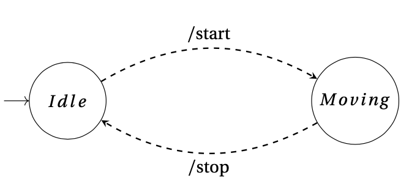
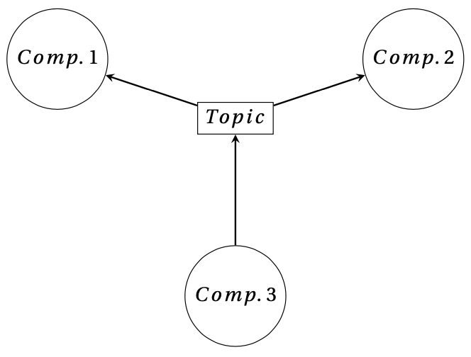
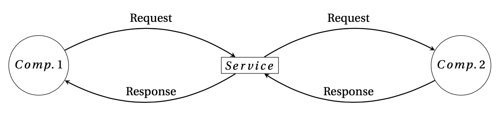
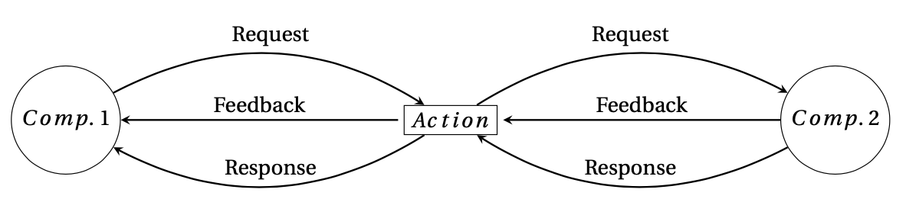
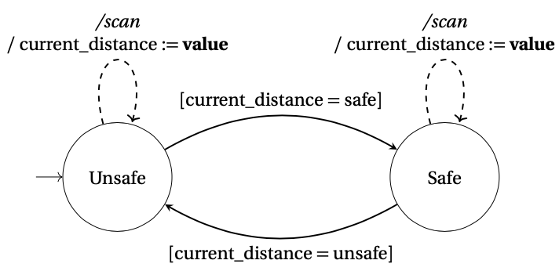

# RoboSC
This repository contains the source code of the RoboSC (RSC) language. This domain-specific language (DSL) supports and accelerates the development of safe, autonomous robots. The language allows developers to model the components and communications of each robot, and specify requirements for them. Using supervisory control synthesis, a controller is constructed that can run as a node on the execution platform.

A presentation that highlights the capabilities of the languages can be found [here](https://robosc.bartwesselink.nl).

## Supported execution platforms
Currently, the DSL supports the generation of controllers for:

* ROS1
* ROS2

## Video
[Link to a video of a line follower and maze solver running with RoboSC](scenarios/scenarios.mp4)

## Grammar
The grammar of the language (in Xtext-format) can be found [here](language/nl.tue.robotsupervisorycontrollerdsl/src/nl/tue/robotsupervisorycontrollerdsl/RobotSupervisoryControllerDSL.xtext).

## Concepts
This section contains all the concepts of the language and how they should be used. Throughout this section, a running example will be considered to make the concepts that are explained more concrete. The ontology of this robot consists of two motors that allow the robot to move in the two directions. Furthermore, it contains a sensor that can find a line, and if it has found one it can measure the offset of that line to the center of the robot. The robot is also equipped with a distance sensor which measures the distance to an object in front of the robot. If there is an obstacle, the robot can use its grabber to pick up the obstacle. Lastly, a light bulb is attached to the robot which can be used to represent the internal state of the robot.

The goal of the robot is to follow a line. If it finds something that is in front of the robot, it should stop moving and pick the obstacle up using the grabber. In the case that there is no line at all, the light bulb on the robot should be activated.

### Base
When a language user creates a model in the DSL, it can either start with a robot concept, or a library concept. The concept of a robot allows the definition of all components, their behaviour, their inputs and outputs, datatypes and the requirements that the controller should adhere to, whereas a library can only be used to define all aspects of one or multiple components. These can be re-used within the definition of a robot to accelerate development of different controllers for similar platforms.

For the example that was mentioned in the beginning of this section, the robot concept should be used. It receives a name, which is used to identify the robot. The code, below, still looks pretty empty, but will take shape in the next sections.

```robosc
robot LineFollower {
    // Further robot code
}
```

### Components
A component can be defined as a virtual, software abstraction of a part of a robot. Although there is no explicit one-to-one mapping to a middleware node, this will often be the case as, at least for some robotic middlewares, it is expected that "each node in should be responsible for a single, module purpose" (see the ROS2 documentation).

For each component the communication with the middleware can be specified. Using this information, the internal state of the component can be modelled. This is referred to as the behaviour of a component, and can be specified using an automaton. An example of this behaviour can be found in the figure below, where the internal state of a (simple) component is represented by two uncontrollable events: start and stop. These events are controllable events.



It is also possible to reference a component from a library by using an import. This is referred to as an imported component, and does not allow the specification of any additional inputs, outputs or behaviour. A component that is defined within a file itself is called a local component.

For the example robot that should follow a line, five different components can distinguished. Each of the actuators and sensors is modelled as an individual component. For the actuators, this means that there are components for the light bulb, obstacle grabber and the motor. The sensors are represented by two components. One for the line detector and one for the distance sensor. This code for this model is shown below.

```robosc
robot LineFollower {
    component DistanceSensor {}
    component ObstacleGrabber {}
    component LightBulb {}
    component LineDetector {}
    component Motor {}
}
```

### Data types
The language distinguishes three different types of data:
- Basic data types
- Complex data types
- Arrays

First, basic data types consist of *strings*, *booleans*, *integers*, *doubles* and the *none*-type. Additional constraints as to where they are used in the language may apply. The complex data types consist of objects and enums. Objects define key-value pairs, each with an associated data type. They may be used recursively. Enums are used to convert input data, based on a set of conditions, to a finite set of values. This helps to prevent exponential growth of the amount of possible states when using integers in controller synthesis, for example. An enum is defined as a set of transformation rules. Then, arrays are defined as a list of another data type. Restrictions apply as to where they are used, they can only be used to model the format of data coming from the middleware, not as a datatype for a variable.

For the example of the line follower robot mentioned in the introduction, four custom data types are needed. The first object datatype, *Twist*, represents the structure of the data that is sent to the motor. It stores a linear and angular velocity, which are both represented as a vector. This vector is modelled as a separate object datatype, which is referenced from the *Twist* data type. The third object datatype represents the request to the light bulb which will update its state. Next to the three object data types, there also is an enum type that converts the value that is coming from the distance sensor to a finite set using transformation rules. The value of the distance sensor is a double. If it is higher than a certain threshold, the distance is defined as *free*. If not, and by default, the value is *obstructed*. These data types will be used in the section on communication. The syntax for all these concepts is written down below.

```robosc
robot LineFollower {
    // ...

    datatype object Twist {
        angular: Vector3
        linear: Vector3
    }
    
    datatype object Vector3 {
        x: double
        y: double
        z: double
    }

    datatype object LightBulbRequest {
        ^state: boolean
    }

    datatype enum DistanceEnum from double to {
        value >= 10 -> free
        default -> obstructed
    }

    // ...
}
```

### Expressions
The language supports a basic set of expressions that are used in different parts of the language, for example in passing data to the communication items, assigning values or specifying requirements. The following types of expressions are supported:
- Conjunction
- Disjunction
- Equation
- Implication
- Addition
- Subtraction
- Multiplication
- Greater than
- Greater or equal than
- Less than
- Less or equal then
- Negation
- Assignment

To allow users to reference variables, states, enum value names or object properties in an expression, the language defines the concept of an access model. This model lets users reference the value of such an item. It is possible that the access is nested, for example if users want to reference the property of an object, which is also a property from a parent object.

### Interfaces
The language defines the concept of an interface, which describes the software packages that contain the format specification of data coming from the middleware. Each message, service and action has a corresponding data type. Although some basic data types are supported out-of-the-box, more complex ones require external software packages. The content of these interfaces can be described via custom data objects. Interfaces can contain one or more data types. For example, an action interface contains three data objects: the goal, feedback and response. The language user can define interfaces for a robot that contain the name of the package, and the name of the interface. Then, each communication item that uses a complex data type can reference this interface.

The example robot uses a data type *Twist* from an external package, *geoemtry_msgs*. This is declared as a single interface which references the mentioned packages below. There are also two communication items that need data formats from an external package.

```robosc
robot LineFollower {
    // ...
    
    interface twist use Twist from geometry_msgs
    interface light use LightBulbService from robot_common
    interface grabber use GrabberAction from robot_common

    // ...
}
```

### Communication
The inputs and outputs of each component are defined as communication types. These communication types correspond to the the types of the supported middleware.
- Messages
- Services
- Actions

#### Messages
Messages are published using an anonymous publisher/subscriber model in the middleware. A message can either be a message that is going into a component (so the component subscribes to), or a message that is going out of a component (and the component publishes to). A message has a name and optionally a topic can be specified. If no explicit topic is specified, the name of the message will be used as the topic. Furthermore, a message has a corresponding data type that contains the format of the message. An illustration of the communication process is depicted in the figure below.



In the example that was set in the beginning, there are three components that define messages. First, there is the distance sensor component, which provides the supervisory controller with a message that contains the distance to an object. It is an outgoing message from the component to the controller, and has an enum data type which was already defined above. The topic name is defined explicitly. Then, the line detector component also defines outgoing messages. These messages represent the correction value and the event that there is no line. The correction value has a type *double*, whereas the no line message has no attached datatype and is therefore assigned the *none* type. Lastly, there is the motor component which receives incoming messages that control the movement of the robot. These messages are defined separately, but they map to the same middleware identifier. They differ in the data that will be sent along with the message. The move message will move the robot forward, whereas the stop message requests the robot to halt its movement. The data type of both commands refers to the complex data type *Twist* that was defined above. Furthermore, the message should be linked to the interface of that data type. The code is like the following:

```robosc
robot LineFollower {
    component DistanceSensor {
        outgoing message distance with identifier: "/distance", type: DistanceEnum
    }

    // ...

    component LineDetector {
        outgoing message correction with identifier: "/correction", type: double
        outgoing message no_line with identifier: "/no_line", type: none
    }

    component Motor {
        incoming message move with identifier: "/vel", type: Twist links twist
        incoming message stop with identifier: "/vel", type: Twist links twist
    }
}
```

#### Services
Another type of communication, are services. The software architecture of a service follows the call-and-response architecture, similar to that of the HTTP client and server model. A schematic overview is depicted in the figure below.



Within the example, there is only a single component that offers a service, which is the light bulb. It offers a service which can be provided with a *boolean* value that represents the state of the light bulb: on or off. If *true* is sent to the light bulb, it will be turned on, and it will be turned off if *false* was sent. The data type of this request was already modelled in the section on data. The corresponding service interface, that contains the data type, is also linked. The code for such a service is like the following:

```robosc
robot LineFollower {
    // ...

    component LightBulb {
        service set_light_state with request: LightBulbRequest, response: none links light
    }

    // ...
}
```

#### Actions
The last type of communication that can be defined on a robot, are actions. These actions are intended for tasks that happen for a longer time (according to the ROS2 documentation). Furthermore, during the period that the action is running, feedback about the process is published to a topic that can be consumed by the initiating node. A schematic overview looks like the following:



The example robot has an action which can be started to pick up the obstacle that is in front of the robot. It does not need require any data, therefore the data types of the request, response and feedback of the action are of type none. It is required that the action is linked to the interface that was already defined, which represents this empty action format. The definition of such an action can be seen in the code below:

```robosc
robot LineFollower {
    // ...

    component ObstacleGrabber {
        action grab with identifier: "/grab", request: none, response: none, feedback: none links grabber
    }

    // ...
}
```

### Automata
Within the language, components can define their behaviour in form of an automaton. An automaton has one or more states, and should have a single initial state. A state can also be labelled as marked in supervisory control theory (Ramadge, Woham 1987). It should be possible to reach a marked state from all of the other reachable states (based on *CIF3: Data-based supervisory controller synthesis* by Eindhoven, University of Technology). Each state can define a set of transitions. This can either be result transitions, or tau transitions. Result transitions occur when communication with the middleware happens. Events that trigger these transitions are requests, responses, feedback and errors. Tau transitions can be executed as soon as the guard is enabled. An example of such an automaton, with incoming messages and tau transitions, is depicted in thhe figure below. Note that the *value*-keyword in the assignments represents the data that is coming to the middleware.



In some cases, a user might want to have transitions that are present in every state within the automaton. In this case, the option is offered to define them on the automaton level, rather than on a single state. Then, the transition will be possible in all states that are defined within the automaton. This is especially useful in a case where a user wants to receive incoming data in all states and store it. 

To store data, automatons can define variables. The variables have a data type, which should be a simple data type. Upon a transition, these variables can be assigned, for example based on the data that is received from the robotic middleware. The data from the middleware is represented by the *value*-keyword in an assignment.

The example in the introduction of this section requires the definition of the behaviour of three components: the distance sensor, the obstacle grabber and the line detector. The distance sensor only has a single state, in which it senses the distances and publishes this value. Upon a response from this message, the value is stored in a variable. The variable is defined in the automaton. For the obstacle grabber, there are two states. The first state where it is idle, and a state where it is grabbing an object. Note that the idle state also represents the initial state, and is marked, because the component will eventually return to that state. When started, the component transitions from its initial state to the state where it is grabbing, until it has finished grabbing the object, after which it returns to the initial state. Then, lastly, the line detector also knows two states. There is a state when there is no line, and there is a state where a line was found. From the initial state, there is a result transition which takes the automaton to the state where a line is found. In this state, any incoming correction values are stored in a variable on the automaton. The code for these components is depicted below.

```robosc
robot LineFollower {
    // ...

    component DistanceSensor {
        // ..

        behaviour {
            variable current: DistanceEnum = obstructed

            initial marked state sensing {
                on response from distance do current := value
            }
        }
    }

    component ObstacleGrabber {
        // ..

        behaviour {
            initial marked state idle {
                on request to grab goto grabbing    
            }

            state grabbing {
                on response from grab goto idle
            }
        }
    }

    component LineDetector {
        // ..

        behaviour {
            variable current_correction: double = 0.0

            initial marked state no_line {
                on response from correction goto line_found
            }

            state line_found {
                on response from no_line goto no_line
            }
        }
    }

    // ...
}
```

### Data provisioning
Controllable communication takes place when certain requirements are met. This means, that there is no direct invocation of communication, much like a method in a regular programming language like Java or C++. Therefore, it is not possible to directly pass data to it.

To solve this problem, the language introduces the concept of provide-statements which link data to the communication with the robotic middlware. These statements provide communication with data, based on *boolean*-expressions. These *boolean*-expressions determine whether data should be sent along with communication based on the current state of the supervisory controller.

The example robot from the introduction requires some provide statements. First, the messages that are sent to the motor require a linear and an angular velocity. For the move message, this means that the robot will be provided with a constant value for the linear speed, and a fraction of the line correction value for the angular speed, such that it can steer towards the line. The stop command will be provided with a value of zero for both the linear as well as the angular speed. The service that updates the light state also requires a value, depending on the state of the line detector component, which is added as a condition. The provide statements are outlined below.

```robosc
robot LineFollower {
    // ...

    // Provide communication with the correct speed
    provide move with {
        linear: { x: 0.4 },
        angular: { z: LineDetector.current / 100 }
    }
    provide stop with {
        linear: { x: 0.0 },
        angular: { z: 0.0 }
    }

    // Enable light when no line found
    provide set_light_state with { ^state: false } if LineDetector.line_found
    provide set_light_state with { ^state: true } if LineDetector.no_line

    // ...
}
```

### Communication requirements
In order to restrict the behaviour of controllable communication, the user has to define requirements. Requirements are split into two types:
- Requirements that disallow controllable communication to take place based if a condition holds. This condition is captured using a *boolean*-expression.
- Requirements that need a condition to hold in order to have the communication take place. This condition is captured using a *boolean*-expression as well.

It is possible to specify requirements either for a single communication item, or for a set of communication items.

There are a total of four requirements for the example robot. For the move message, nothing should be in front of the robot and therefore the distance sensor value should be equal to *free*. Furthermore, the robot should not move while grabbing anything and therefore the obstacle grabber should be in state idle. The stop command should be executed if one of these conditions does not hold, so if the distance sensor has something in front or the obstacle is being picked up. The last requirement specifies that if the distance sensor says there is nothing in front of the robot, the obstacle grabber action can not start, as it has nothing to pick up. These requirements are shown below.

```robosc
robot LineFollower {
    // ...

    // Movement
    requirement move needs DistanceSensor.current = free
    requirement move needs ObstacleGrabber.idle
    requirement stop needs DistanceSensor.current = obstructed or ObstacleGrabber.grabbing

    // Grabbing
    requirement DistanceSensor.current = free disables grab

    // ...
}
```


